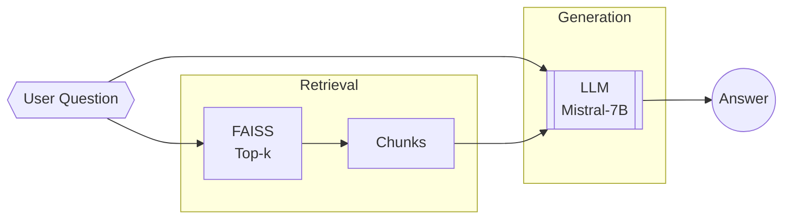

# Retrieval‑Augmented Generation (RAG) Platform — **All‑Local Models Edition**

> **Embeddings:** [`BAAI/bge-small-en-v1.5`](https://huggingface.co/BAAI/bge-small-en-v1.5)  (384‑dim)  
> **Generation / Summarisation:** Quantised [`mistral‑7b‑instruct‑v0.2.Q3_K_L.gguf`](https://huggingface.co/TheBloke/Mistral-7B-Instruct-v0.2-GGUF) served with **llama.cpp**  

This variant keeps the entire RAG stack self‑hosted, removing dependency on any proprietary or cloud LLM APIs.

---

## What changed?

| Area | Original | **Local‑Model Edition** |
|------|----------|-------------------------|
| **Embedding model** | Open‑source model (unspecified) possibly remote | **`bge-small-en-v1.5`** loaded with `sentence-transformers`, runs comfortably on CPU / modest GPU. |
| **Generative LLM** | Summarisation LLM trained via `unsloth` + external registry | **`mistral‑7b‑instruct‑v0.2.Q3_K_L.gguf`** quantised, 4‑bit, run via `llama.cpp` server. |
| **Training pipeline** | Fine‑tuning required | *Optional*: can run **LoRA** fine‑tune on the mistral model with your domain data, or skip to zero‑shot. |
| **Inference serving** | External API / HF endpoint | **Local HTTP server** (e.g. `llama.cpp --server`) or **vLLM**. |
| **Vector index** | Cloud (e.g. Pinecone) | **Local FAISS** or **Chromadb**; embeds stored on‑disk. |
| **Hardware** | GPU for training, maybe CPU inference | <4 GB VRAM GPU **or** recent CPU for quantised LLM; embeddings CPU‑friendly. |

---

## Pipeline Walk‑through

### 1‑2. Data Ingestion

Same ETL from Notion → S3 → MongoDB, with quality filtering.

### 3‑4. (Optional) Fine‑tune Dataset

If you need domain‑specific tone or tighter factuality, generate **instruction pairs** and run **LoRA** fine‑tune of the Mistral model using [QLoRA] for low‑RAM GPUs.

### 5. Model Registry

*Store* the LoRA adapters (few MB) and the quantised base `.gguf` in **S3 / local object store**.  
Tag with metadata: checksum, quantisation type, eval metrics.

### 6. Summarisation / Generation Service

1. Spin up `llama.cpp` server:  
   ```bash
   ./main -m mistral-7b-instruct-v0.2.Q3_K_L.gguf --host 0.0.0.0 --port 8000 --n-predict 1024
   ```  
2. **FastAPI** wrapper exposes `/generate` and `/summarise` endpoints.  
3. Pipeline loads endpoint URL from service discovery (env var / consul).

### 7‑8. RAG Feature Generation

* **Chunking:** 1 k‑token windows, 20 % overlap.  
* **Embedding:**  
  ```python
  from sentence_transformers import SentenceTransformer
  model = SentenceTransformer('BAAI/bge-small-en-v1.5')
  vecs = model.encode(chunks, batch_size=64, device='cpu')
  ```  
* **Index:** FAISS on‑disk (HNSW32, cosine).

### 9. Inference Pipeline



* Prompt template (Mistral‑style):  
  ```
  <s>[INST] 
  You are a helpful assistant...  
  Context: {retrieved_chunks}  
  Question: {user_question}  
  [/INST]
  ```

### 10. Observability

* **Prompt traces**→ OpenTelemetry collector → Grafana Loki.  
* **Quality checks**→ Evaluate answer vs. gold via local Mistral or `bert-score`.

---

## Hardware Sizing

| Component | CPU‑only | GPU‑assisted |
|-----------|----------|--------------|
| **bge‑small embeddings** | 8‑core CPU encodes ~2 K chunks/s | RTX 3060 encodes ~15 K chunks/s |
| **Mistral‑7B Q3** | 16‑core Zen3 ≈ 10 tok/s | 8 GB‑VRAM GPU ≈ 35 tok/s |

---

## Deployment Tips

* Use **Docker Compose** with services: `etl`, `faiss-server`, `llama.cpp`, `rag-api`, `grafana-stack`.  
* Pin the GGUF checksum to prevent silent model drift.  
* Run a nightly cron to re‑embed recently edited Notion pages.

---

*Diagram base by Decoding ML, modifications by you.*
